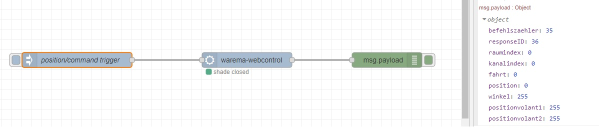

# node-red-contrib-warema-webcontrol

[](https://npmjs.org/package/red-contrib-warema-webcontrol)

> This is not an official implementation!

With this node-red extension you should be able to control a Warema sun shade rollo with a [Warema WebControl](https://www.warema.com/en/control-systems/radio-systems/wms-webcontrol.php) device.
The included node allows you to send three different commands to the inofficial API and it parse the XML result as JSON.



## Usage

### Configuration

This node requires two properties for configuration

```text
url             KEBA url of the charging station web ui
position        Position to move the shade to (in percent)
```

### Examples

It is possible to configure the `command` and `position` property in the node configuration or you can configure them by `msg` properties.

**Request State (Status)**

```text
command = status
```

```jsonc
{
    "befehlszaehler": 7,
    "responseID": 36,
    "raumindex": 0,
    "kanalindex": 0,
    "fahrt": 0,
    "position": 0,
    "winkel": 255,
    "positionvolant1": 255,
    "positionvolant2": 255
}
```

**Request Move (Ready)**

```text
command = move
position = 0 - 100
```

```jsonc
{
    "befehlszaehler": 7,
    "responseID": 36,
    "raumindex": 0,
    "kanalindex": 0,
    "fahrt": 0,
    "position": 0,
    "winkel": 255,
    "positionvolant1": 255,
    "positionvolant2": 255
}
```

**Request Ready (Ready)**

```text
command = ready
```

```jsonc
{
    "befehlszaehler": 113,
    "responseID": 51,
    "requestid": 35,
    "feedback": 1
}
```

### Node States

There are four possible states for the node:

- green: means the shade is closed (position: 0%)
- yellow: means the shade is moving
- blue: means the shade is open with a particular position
- grey: request failed or WebControl is not able to reach the shade

## Contribution

### Prerequisites

-   Installed Node
-   Installed Docker for Desktop (or on Linux native Docker)

### Development

Start locally a Docker container with the following command:

```powershell
# careful this command is i.e. for Powershell
docker run -it -p 1880:1880 -v ${PWD}:/usr/src/node-red/development --name mynodered nodered/node-red

# cleanup
docker kill mynodered
docker rm mynodered
```

Then you can attatch your Visual Studio Code instance to the running container (official `Remote Docker` extension required).
After that you can connect with the Powershell, shell, whatever to the running container by entering

```powershell
docker exec -it mynodered bash

npm install ./development/
```

May you have to restart the container/Node-Red to see the plugin in over the Node-RED UI at `http://localhost:1880/`.

## Contribution

Inspiration by the following links/projects:

- https://pypi.org/project/warema-wms-controller
- https://forum.iobroker.net/topic/7336/iobroker-mit-warema-wms-web-control/92?_=1615929071126&lang=en-US

